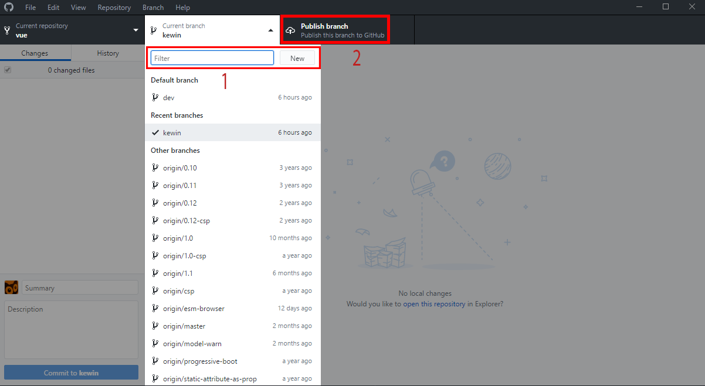
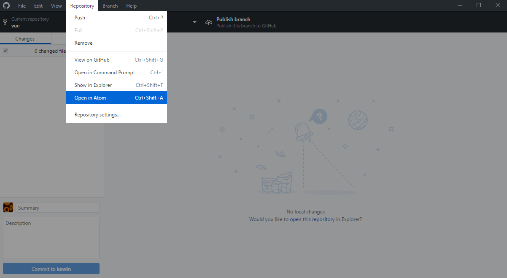

# Template simple pour portfolio stagiaire

## Les outils

1. Créer un compte [github](https://github.com)

2. Installer [github desktop](https://desktop.github.com/)

3. Installer l'éditeur de texte [Atom](https://atom.io/)

4. Depuis Atom, installer l'extension [Emmet](https://atom.io/packages/emmet)

5. Installer aussi l'extension [github](https://atom.io/packages/github)

6. Dans Atom toujours ouvrir l'onglet github (Packages > GitHub > toggle git tab)

## Processus

1. Dans github, importer une copie du projet portfolio initial sur votre compte (fork)

2. Cloner en utilisant Open in Desktop

3. Depuis github desktop : Créer une nouvelle branche à votre nom (ex:jeanmarie) et publier

4. Depuis github desktop toujours : Repository > open in Atom

5. A partir de maintenant, vous pouvez modifier votre branche du projet, personnaliser le HTML et créer une feuille de style.

Les fichiers modifiés doivent êtres échangés et commentés dans l'onglet git. (stage all & commit message)

Avec les 2 flèches en bas à droite d'Atom, il faut publier les changements (push)

Pour exemple ma page est visible [ici](https://kewinmarchand.github.io/Portfolio/)
